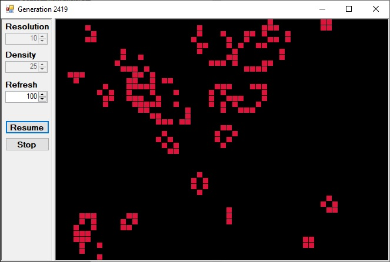

# Игра - жизнь
Перед Вами сейчас игра жизнь которую придумал Джон Конвей.

Это плоскость, на которой живут клетки. Каждая клетка - это живое существо.  Существуют определенные условия благодаря которым клетка может существовать, зародиться новая клетка и погибнуть.

Для поддержания жизни клетки нужны соседи. Два или три соседа. Если их меньше двух то клетка погибает от одиночества, и если их больше трех то происходит тоже самое, клетка тоже погибает, но в этом случае от перенаселения. Таким образом клетка может жить пока у нее есть два или три соседа.

Помимо этого если клетка не занята  пусто там еще ничего нету никакой жизнь и возле такой пустой клетки которая либо изначально была пуста либо же там была какая другая погибшая клетка но сейчас-то ничего нет так вот если возле этой пустой клетки находится  живые  клетки то там зарождается жизнь таким образом жизни в этой вселенной циклическая каждый новый цикл происходит  проверка вот этих правил для всех клеток в игре и соответственно появляется новые  клетки погибают старые но либо же для некоторых везунчиков все остается без  изменения с правилами разобрались теперь еще пара важных моментов код который мы сегодня с вами напишем  будет требовать рефакторинг ну и понятное дело что сама вселенная можно развивать добавлять новые правила  модификации все такое проще по понятным причинам тол будут ли эти видео будущем зависит от того насколько вас  заинтересует конкретно этот ролик от количества просмотров и лайков так что и думал вы знаете что нужно делать но  независимо от этого для того чтобы понимать почему то кот требуют рефакторинга рекомендую  почитать две вот эти книги но и как всегда исходный код данного урока для патронов канал с доступом к исходникам  будет доступен на патреоне и кстати то рекомендую подписаться на мой второй канал ссылку найдете в  описании ну а теперь к делу давайте нажмем кнопку стоп остановим игру и посмотрим на некий особенности  которые у нас здесь реализованы у нас здесь есть два параметра resolution идентифик resolution у нас отвечает за  то какой масштаб нашей вселенной нашего мира то есть чем больше у нас resolution тем  соответственно крупнее все объекты у нас здесь изображены и соответственно меньшее количество на экране у нас по  месяца поставим на восьмёрку для примера который я хочу вам показать и теперь посмотрим на density параметра density у  нас зависит изначально какая плотность населения при генерации первого поколения конкретно в этой реализации  чем меньше данный параметр чем больше плотность населения двойка здесь у нас минимальное  значение здесь и сейчас создадим мир в котором будет плотность населения гораздо меньше соответственно данный  параметр мы увеличим и нажмем кнопку старт и так вот у нас очень маленькая  плотность населения и хочу сразу же обратить ваше внимание на то что скажем так данный момент но здесь очень много  стабильных участков здесь есть фигуры состоящий из нескольких клеток которые вообще никак не изменяются и есть фигуры  которые постоянно изменяются но они извиняются на одном месте такие особенности у нас связаны с тем какие  собственно правило у данной игры как я уже говорил для того чтобы клетка могла  поддерживать свою жизнь ей нужно два или три соседа соответственно если два или три соседа у клетки есть то она не может  умереть и если вы вот посмотрим на какие-то фигуры которые стабильные допустим большой квадрат который состоит  из четырех клеток то у каждого элемента у каждой клетки которые являются частью  этого квадрата всегда есть три соседа то есть данном случае каждая клетка этого квадрата поддерживает остальные клетки  и так как у них нету никаких внешних раздражителей никто не вторгается в их пространство не пытается как-то повлиять  на их жизни они могут так существовать бесконечно но есть одно маленькое но они не могут дать потомство потому что для  того чтобы у нас про извелась новая клетка что по зародилась жизнь в клетке где ее нету  нам необходимо чтобы рядом с этой пустой клеткой были три клетки где жизни есть  если мы к примеру посмотрим на пустые клетки рядом с этим квадратам то  становится понятно что у любой пустой клетке рядом с этим квадратам есть качестве соседа если можно так  выразиться только две клетки есть жизнь а две клетки соответственно зародить по жизни не  могут соответственно вот благодаря отметим правилам у нас и появляются некие фигуры на мировой карте которые  могут просто поддерживать свою стабильность они могут жить все вместе если никто им не мешает никто не  вторгается в их пространство но и дать потомство они не могут но наши реализации игры я предусмотрел возможное  чтобы мы могли сами создавать их дополнительные клетки пусти мыслимо мышкой это как проведем  с мы можем добавить новых жителей в наш мир и соответственно мы их можем и удалять  левой кнопкой мышки мы будем добавлять правой кнопкой мышки ну скажем так удалять удалять что угодно  уничтожить наш мир так вот если мы рядом с пляжем так с нашим островком  стабильности вот этим вот квадратом добавим новые жители побольше они могут вторгнуться в эту  стабильность соответственно вот эти клетки которые были частью этого квадрата не смогут поддерживать свою жизнь стабильную и с ними что-то  произойдет дальше пойдет развитие помимо этого у нас вот есть такие моменты  такие регионы из нескольких клеток которые постоянно двигаются опять-таки это тоже связано с понятное дело с  правилами жизни в нашем мире здесь выходит так что у нас постоянно зарождаются новые клетки потом их  становится слишком много одна из них умирает и они панова зарождаются при любом случае этот мир всегда стремится  какой-то стабильности и упорядоченности и скажем так рано или поздно все  заканчиваются тем что у нас наблюдается либо же островки стабильности которые  сами могут поддерживать свою жизнь но не могут дать потомство либо же такие островки но скажем так это же  стабильности который никуда не двигаются на которых постоянно зарождается новая жизнь и погибает старое вот кстати у нас  пошла колонии путешественников которые сейчас испортила жизнь какому-то строку стабильности но благодаря этому  зародилась на довольно большое количество новых клеток и собственно жизнь нашей вселенной нет  кардинально измениться кто знает в общем затем все можно наблюдать бесконечно помимо этого мы можем еще одна сеть  изменения коррективы в этот мир  собственно давай посмотрим как все это дело и реализовать приступим к созданию проекта запускаем  visual studio нажимаем кнопку create a new project и здесь нам нужно найти windows forms of  на базе did not фреймворк выбираем этот пункт нажимаем next далее нам необходимо указать локейшн то есть место  расположение нашего проекта на звание самого проекта выбираем версию этот  фреймворк просто выбираете максимально позднюю версию которая вам доступна и нажимайте next для начала нам необходимо  набрать интерфейс я эту форму изначально немножечко растяну нам потребуется  открыть tool-box котором будут все компоненты которые нам протыкает windows forms если у вас данной вкладке tool-box нету  вам нужно нажать кнопку по видео и выбрать пункт tool-box тогда у вас этот компонент здесь вот  слева появится прежде всего нам необходим сплит контейнер выбираем его перетягиваем на нашу форму далее нам  нужно нажать на данный сплит контейнер правой кнопкой мышки нажать пункт properties обратите внимание сплит  контейнер как бы у нас состоит из самого сплит контейнера и двух ложных элементов папой на владин и по   так вот нам нужно выбирать не понял этим и поймал два именно сам сплит контейнер мы можем либо по разделителем нажать  мышкой тогда мы выберем сплит контейнер либо же вот справа нам нужно выбрать именно сплит контейнер  далее для  нашего сплит контейнер  давайте окажем border style fix d таким образом наш  разделитель станет в поле заметил в левой части у нас будут настройки наши  игры с правом само игровое поле можем принципе даже формочку немножко увеличить я не хочу чтобы у нас этот  сплит контейнер двигался он нам нужен скажем так просто для красоты для того чтобы отделить в отдельную часть  настройки в отдельную часть самой грубой область соответственно вот этот сплиттер нам  нужно заблокировать опять-таки нам нужно чтобы у нас был выбран сплит контейнер в properties он сейчас называется спид контейнер один  другого у нас нету параметр из сплиттер fix нам нужно поставить в true и в параметр fixed павел нам нужно поставить  павел один сохраним наш проект через control of  запустим вот он наш интерфейс и вот эту панельку наш свитер  мы сейчас сдвигать не может принципе мы этого и хотели добиться следующие компоненты который нам потребуется для того чтобы  мы могли там отрисовывать наше игровое поле нашу вселенную этот picturebox найдем его в боксе перетащим на правую  панель нас здесь интересует параметр долг выбираем вот это вот центральную часть таким образом его значение  изменяться в фил и это раз тянет его на всю панель займемся настройками и кнопка  ну во первых нам понадобится парочка выебав где мы сможем просто хранить текст пока вот в таком виде его и  оставим и следующий компонент который нам понадобится это компонент на берег  отдал это вот именно та самая штука которая позволяет нам манипулировать исламе в качестве параметров зайдем  свойства компонента номере когда он первое что нас здесь интересует это параметр текст оnline я хочу чтобы он  был райт чтобы число которое выступает нос качестве параметра было с правой стороны этого компонента данный номере  когда у нас будет отвечать за разрешение то есть за резолюцию поэтому давайте его имя изменим чтобы нам было понятно потом  к какому компонента обращаться за дамой информации заданными параметрами но мэри когда он я сокращу до аббревиатуры чтобы  было понятно что это за компоненты еще добавлю слова resolution соответственно мы теперь с вами знаем что вот эта штука  это у нас на марик of dawn который называется resolution для чего нам это  было нужно давайте сразу же посмотрим когда у вас открыто вот эта формочка нажимаете клавишу и всем вы можете  открывать код этой формы и соответственно давайте где-то в конструкторе этой формы просто  обратимся к нашему компоненту вот смотрите у нас теперь есть компонент на   solution у которого есть обозначения в или соответственно то что вот там в цифрах  мы поставим будет в этом параметры и у нас таких компонентов может быть несколько соответственно теме на которые  мы им будем давать потом мы в ходе сможем использовать вернёмся в код формы обратимся теперь к лэйблом лейбла тоже  есть имя но в коде мы не будем к ним обращаться он для нации носит чисто информативный характер нас интересует  только его свойство текст собственно здесь мы напишем слово resolution то есть разрешение для того чтобы было  понятно к чему относится вот это вот штука это у вас разрешение и давайте  зайдем в его настройки шрифтов фонд пусть у нас будет полужирный наверно  можно немножечко шрифта увеличить в  вот теперь мы можем два этих компонента  скопировать просто выделяем еще решив нажимаем kontrol ц control-d они у нас копируются мы сюда вот так  тянем мы их копируем для того чтобы и настраивать потом опять всех параметров вручную потому что нам те же самые  параметры нужны обратите внимание у нас вот этот лейбл это лейбл   global  который мы скопировали это лейбл  называются они по-разному на ему у них разные но текст одинаковые поэтому на  ether интерфейсе мы их видим как будто бы они одинаковые у второго мы текст поменяем  лейбл у нас будет описывать  значения вот этого параметра и здесь у нас будет информация там какая у нас будет плотность населения соответственно  вот этот на марик up down мы тоже переименуем назовем его над density ты сна мы теперь можем давать  параметрам регулировать чё парочка нюансов которые мы здесь должны установить ну во первых у нас не может  здесь быть значения  и в разрешении не в density о свойствах но марика  которые встречаются резолюшн значение максимум давайте ограничим а  а  минимум единицу на самом деле разрешение в единицу у нас будет не совсем рабочим  вариантом потому что каждая клетка у нас будет занимать один пиксель и все это будет довольно медленно обрабатываться  поэтому тормозить вот эта двойка это реально рабочий вариант но мы можем  оставить единицу для того чтобы иметь возможность просто посмотреть как оно все таки будет выглядеть хотя мы будет  тормозить а для density мы поставим минимальное значение   максимально можно принципе не ограничивать пускай там  таки останется помимо этого нам необходимо  установить дефолтное значение это поле в или для денется тема так и оставим  а для  resolution наверное петра зона вокруг тройки поставить теперь нам необходимо добавить еще парочку кнопок  вытянем сюда кнопку и стал бокса скопируем и вставим и данной кнопки у нас будут включать за  start и stop нашей игры нам необходимо поменять их название и давайте кстати поменяем им  еще и шрифты я выделил сразу две эти кнопки зашел  настройке функции поставляем полужирный шериф  пускай тоже на  быть вот как  то так давайте немножко эти кнопки растянем пускай они будут слегка побольше можем  даже и вот так сделать и почему нет помимо этих компонентов нам еще  понадобится и таймер вот такой компонент нажимаем на него два раза кнопкой мышки  вот здесь внизу у нас добавился нам этот таймер понадобится для того чтобы вызывать события отрисовки и  генерации новых поколений наших клеток если мы зайдем в пропорции этого таймера  мы видим что здесь есть интервал это интервал его срабатывания за каждое  срабатывание этого таймера у нас должно генерироваться новое поколение клеток и соответственно отрисовывается то что  было сгенерировано кстати давайте немножечко все таки формочку меньшим она  не помещается у нас полностью я бы этот интервал постоял поменьше где-то назначение  миллисекунд  думаю будет в самый раз теперь зайдем в события этого таймера эванс вот такая  вот молния здесь есть события тег и в пустое поле просто нажмем два раза кнопкой мышки соответственно у нас  генерироваться метод который будет вызываться во время этого события из нас  и будет логика генерации следующего поколения и его отрисовки для кнопок нам тоже необходимо  подписаться на события клика по этим кнопкам на прежде чем мы это сделаем давайте вернемся в properties  наших кнопок и переименую их первую кнопку назовем б старт то есть батон  стару сокращенная вторую кнопку стоп ну  и теперь жмем  раза левой кнопкой мышки по первой кнопки у нас генерируется этот  где будет обрабатываться событие клика по этой кнопке и для  кнопки сделаем то  же самое в принципе юзер интерфейс у нас уже готов теперь можем приступить непосредственно к реализации логике наши  игры для начала давайте просто попробуем что-нибудь отрисовать нашем игровом поле просто какой-нибудь квадратик  для того чтобы понять что скажем так а наша схема рабочие для отрисовки нам  потребуется класс graphics нам необходимо объявить объект этого класса  ты давайте пока вот здесь в обработчике события клика по кнопке  батон старт продолжим писать наш код сейчас пока напишем простенькая логику  для отрисовки графики потом все это по выносим уже в отдельные методы отрисовывать графику мы будем в нашем  texture боксе его и свойства и матч идет собственно содержится картинка здесь мы должны  создать новый bitmap по сути картинку размер картинки должны соответствовать нашему picturebox у поэтому у этого  picturebox а нам потребуется твой ствовать то есть его ширина пиво него  уже свойства хайд то есть по высота таким образом в нашем пещер бокса мы создаем новый бит но по факту новую  картинку далее нам необходимо создать объект graphics и присвоить его вот это  вот переменную которую мы здесь выше объявили для этого нам необходимо обратиться к классу graphics вызвать  метод from и матч и в качестве параметра передать им а что самого picturebox а  которой мы создали на предыдущей строчке кода пир вас есть возможность от рисовать различные примитивные фигуры в нашем случае нас  интересует кадра для того чтобы что-то отрисовать нам необходимо обратиться к объекту graphics квадрат это скажем так  один из частных случаев прямоугольника поэтому мы будем вызывать не тот фил  крик тангл ну то есть заполнить прямоугольник  параметр отвечает за только цвет он будет здесь мы обратимся  классов браш из и и я выбираю цвет crimson это вот тот самый красный цвет который нас отрисовывать все клетки в  нашей игре в дальнейшем у нас здесь есть несколько перегрузок которые отвечают за начальные координаты прямоугольника  из-за его ширину и высоту укажем начальные координаты по нулям и качестве  длины и высоты нам необходимо использовать значение разрешения этот элемент an american down  именно для этого нам и был необходим давайте под него создадим отдельную переменную  и соответственно вот здесь нажатие на нашу кнопку еще до создания картинки в эту переменную мы будем  присваивать значение нашего на марика простите внимание у него тип данный bc мало нам нужен and можем просто  выполнить приведение типов далее вот эту переменную риза вершин мы передаем  качестве параметров а при заполнении нашего прямоугольника здесь нас интересует ширина и высота но собственно  так как мы рисуем квадрат плюс ширина и высота у нас будет одинаковое будет соответствовать значению этого вот параметры resolution теперь мы можем  запустить нашу программу и нажать кнопочку start сейчас у нас по нажатии  этой кнопочке просто от рисуется прямоугольник причем где то вот здесь и довольно маленький потому что у нас только в  пикселя  будет его высота и ширина но он там есть давайте по максимуму увеличим resolution сколько  у нас позволяет ну собственно вот он наш прямоугольник таких прямоугольников нам потребуется очень много  как то мы будем отрисовывать все клетки нашей силе конечно же отрисовка прямоугольника при нажатии по кнопке  старт нам не нужно но тем не менее вот эти вот все действия которые инициализирует оси объект который нам  нужны для тресов графике мы можем оставить я бы хотел а вынести функционал создания  вообще нашей новой игры с этапа разрешения и всего такого прочего в  отдельный метод поэтому я этот самый метод создам этому ведь отсюда скопируем  поместим в этот метод а сам метод start game будем вызывать  обработчики событий аббатом клик что нам необходимо еще здесь нашем методе start  game но во первых все события в нашей регенерации следующих поколений все  отрисовки будут происходить по событию таймера соответственно когда таймер у нас работает тикает скажем так что мы не  должны иметь возможность создать новую игру соответственно прежде чем выполнять все действия методе start game мы будем  проверять наш таймер его свойство рен и был и если у нас будет включен то есть  свойство enabled будет труп ничего не будем делать хотим просто выходить из этого метода  когда у нас игра уже стартовала мы не должны прямо во время того как она сгенерируется новое поколение  выполняется отрисовка иметь возможность изменять разрешение или а плотность  населения но это на самом деле бессмысленно соответственно вот эти две кнопки и два компонента момент нажатия  кнопки старт у нас будут блокироваться помимо этого нам каким-то образом требуется хранить информацию тоном  девкой клетки у нас находится какой-то живой организм где у нас пустая клетка и  соответственно каким-то образом считать их соседи все такое прочее так вот для того чтобы эту информацию хранить нам  потребуется двумерный массив и нам необходимо определиться какого типа данных этот массива у нас будет в  текущей реализации этой игры у нас состоянии клетки может быть только два либо на живой либо мертвых либо на там  есть либо ее нет соответственно для этих целей мы можем использовать тип данных ул который может принимать все значение  либо да либо нет либо true либо фоллз обеим двумерный массив типа bool по факту этот двумерные массивы  будет представлять наше игровое поле наша вселенная ну скажем некую табличку  из клеток я так и назову этот массив фил но то есть поле при создании данного  массива нам необходимо будет вычислять количество строк и колонок данном  массиве мы не можем генерировать напрямую количество строк и колонок в массиве от того сколько пикселей у нас в этом  picturebox ну потому что у нас каждая клетка соответственно будет занимать один пиксель вообще то как бы мы это  можем делать но нам будет ничего не видно плохо довольно видно которых это будет  очень медленный работ соответственно именно для этого мы ввели параметр разрешения и  для того чтобы рассчитывать количество строк и колонок для нашего массива соответственно мы должны создать две  переменные создавать наше игровое поле мы будем момент старта нашей игры после того как уже нам будет известна  разрешение то есть перемена resolution присвоенное какое-то значение ну а для того чтобы создать игровое поле  нам предварительно необходимо рассчитать количество строк колонна как нашем игровом поле соответственно количество  строк которая у нас должно быть у нас должно зависеть от того какая высота у нас игрового поля то есть вот этого  нашего picturebox а где у нас будет отрисовывается она также должны зависеть от разрешение которое мы выбрали для  нашей игры таким образом в переменную rolls мы будем помещать значение поля хайд нашего picturebox а  деленное на разрешение и соответственно для поле colors у нас будет то же самое  но только с полем быть далее нам необходимо создать игровое поле то есть  нашему следу мы нам будет удобнее представлять расположение элементов а то есть по сути клеток в нашем массе будто  они расположены на координатные плоскости до картера координаты оси xy оси y ну и соответственно при обращении  к индексом массива мы будем сначала указывать x потом и соответственно когда мы создаем этот массив мы сначала  указываем размерность колонок затем размерность строк далее после того как  мы создали массируйте у нас будет храниться информация о всех клетках на игровом поле нам необходимо создать  первое поколение этих клеток которые у нас там будут храниться для этого мы  будем использовать генератор случайных чисел мы переберем все все элементы нашего двумерного массива здесь у нас  ось x здесь у нас ось y да и соответственно предварительно нам необходимо создать  объект класса random того чтобы генерировать те самые случайные числа и  соответственно в наш -мерный массив по нужным координатам мы должны  поместить значение либо true либо фоллз то есть есть клетка сгенерировался на или не поэтому  будем использовать объект класса random и вам этот next нам необходимо ограничивать то какое  максимальное значение у нас будет в при генерации случайного числа обращаю ваше  внимание на то что само это максимальное значение в диапазон генерируемых случайных чисел не входит таким образом  если у нас допустим день сеть по дефолту это два и мы здесь в качестве параметра скажем  этот самый d incite только сначала приведем его контур потому что там дать ему да у нас будет сгенерировано  случайное число от  до  у нас скажем просто случайный выбор между двумя вариантами будет у нас  сгенерирован элемент или нет так вот если в случае с генерации случайного числа у нас получился  то значение у  нас будет труп и в field мы присвоим собственно это труп и это будет означать  что мы сгенерировали клетку если допустим в результате генерации  случайного числа у нас будет сгенерировано единица то оно не будет равна нулю и соответственно сюда мы  поместим фолз таким образом чем больше у нас вот это значение d incite  чем больший диапазон генерации случайных чисел тем меньше вероятность тому что  это случайное число которое будет сгенерировано будет равно нулю соответственно чем меньше изначально  элементов массива со значением трубу нас будет соответственно чем меньше  плотность населения у нас будет в первом поколении наших клеток в наших член  ну и в самом конце когда мы все это выполнили выполнили весь этап нам необходимо  стартовать наш таймер для того чтобы игра началась снова объекта таймер -го  вызываемые от старт игра начинается давайте поставим здесь где-то breakpoint и вообще посмотрим что у нас здесь будет  происходить запустим это все дело фдэ баги нажимаем старт таймер у нас был выключен поэтому  у нас сюда пропустила у нас авторитарным не выполнился у нас выключается элементы  управления нашими параметрами игры резолюшн и d incite значение resolution присылается в  переменную resolution мы рассчитываем количество строк и колонок  наша миссия field то есть сколько элементов в игровом поле у нас общий путь и сколько клеток у нас создается  двумерный массив под все это дело далее идёт перебор массива двумя циклами  генерировать случайные числа видите вот один true у нас уже есть  после того как все это произойдёт у нас создается объект класса и матч объекта   класса graphics и стартует таймер собственно наша игра пошла но  поделите у нас должна идти обработка найти китай мера ничего ничего нету поэтому у нас пока  ничего не отрисовывается ну и соответственно мы ничего остановить пока не можешь что мы не реализовали  обработку кнопки stop итак перед нами тч несколько задач это во-первых реализовать отрисовку всех  игровых клеток которые у нас есть далее реализовать остановку нашей игры и наверное самое сложное это реализация  подсчета соседей воздух редки для того чтобы либо же сгенерировать новую клетку либо же решить что наша клетка у которой  недостаточно у соседей или слишком много соседей должно умереть займемся отрисовкой я хочу и таки все  это выполнить в отдельном методом назовем его next generation п  этот метод next generation у нас будет вызываться событий тег ну а собственно  самом методе каждый раз когда у нас будет тикает таймер у нас будет называться этот метод и в этом методе мы  собственно будем выполнять расчет следующего поколения и отрисовку того  что у нас там получилось но во первых каждый раз когда у нас будет сгенерировано новое поколение нам  необходимо очистить игровое поле поэтому объекта graphics мы будем вызывать метод clear мы должны здесь указать цвет  которым мы хотим залить всю игровую области я буду все заливать чёрным цветом но так как у нас было изначально  черный красный вы можете выбирать как вам больше нравится давайте пока просто отрисовку  сделаем здесь опять-таки нам нужен перебор нашего игрового поля поэтому я просто  скопирую эти два цикла который у нас там были немножко выше и давайте сделаем вот что если у нас нашем  массиве field по нужным координатора значения true этот iv у нас выполнится и собственно  здесь мы можем адресовать прямоугольник так как мы это уже делали в качестве  начальной точке где у нас будет отрисовывается прямоугольник тогда мы указывали панелям и он у нас был в углу  а теперь мы будем качестве отступов использовать яндекс нашего элемента в  массиве умноженный на разрешение таким образом мы эти прямоугольники будем сдвигать по  нужным координата соответственно у нас x умноженный на resolution y умноженный на  resolution и далее еще два раза creed iii в revolution для того чтобы  отрисовать шириной высота прямоугольника далее для того чтобы у нас перед  рисовалась игровое поле у самого picturebox а нам нужно вызвать метод  refresh в принципе вот даже сейчас детским и стартанем игру то у нас уже должно отрисоваться игровое поле которое  у нас изначально была сгенерирована с помощью генератора случайных чисел  вот она кстати я хочу чтобы наша игра сразу же запускалась a full screen  скажем так развернутом виде поэтому у нашей формы в дизайне реформ нам  необходимо изменить параметр windows стоит здесь она normal а нам нужно поменять на максимально  соответственно теперь когда наша игра будет стартовать у нас всегда она будет развернуто ведь нажимаем кнопочку старты  и вот собственно изначально игровое поле которое у нас было сгенерировано на самом деле она генерируется каждый тег  нашего таймера но так как оно не изменяется у нас отрисовывается одно и то же поле в принципе мы можем проверить  отрабатывает ли смена кадров просто взял этот кусочек кода где он из генерируется  случайным образом первое поколение вставить его вот сюда [музыка]  запустить но и соответственно у нас случайным образом будут генерироваться  прямоугольники нашем игровом поле но восстановить мы все это дело сейчас не можем потому что  реализация кнопки стоп мы еще не делали давайте стать этим сейчас и займемся создадим метод стопгейм на всякий случай  будем проверять не включен ли таймер вот если таймер не включен то соответственно нам ничего останавливать и  соответственно делать ничего не нужно поэтому будем просто выходить из этого метода а если таймер был включен то у  моего остановим и как вы помните когда мы стартовали игру мы блокировали элементы управления  которые отвечают за плотность населения и за разрешение соответственно когда мы  игру останавливаем нам эти элементы управления нужно включать обратно теперь мы сможем включать и выключать игру да  ещё один маленький нюанс этот стал геем мы должны вызывать в обработчике события батон стоп клик вот чтобы это сработало  теперь мы можем запускать и останавливать нашу игру не останется у нас сейчас здесь просто  генерация случайных прямоугольников кстати чем-то смахивает на qr-код но если мы нажимаем стоп а она работает  если мы к примеру изменим значения d incite тему соответственно плотность наших прямоугольников уже можем изменить  чем больше у нас до языке еще нас плотность если на максималку  выкрутим но вот самая маленькая и помимо этого мы можем еще менять разрешение давайте resolution на  выкрутим как  видите мы теперь можем и увеличивать изображение но соответственно у нас меньше количество элементов будет меньше  клеток на игровом поле но зато они будут крупнее если мы поставим на единицу мы получим вот такую  вот штуку сейчас мы с вами создали генерацию какого-то шума на по факту у нас с вами уже есть модель нашего мира  которая хранится нашем массиве у нас уже есть отрисовка нам необходимо только  реализовать правила по которым будет генерироваться следующее поколение и соответственно игра у нас уже будет  работать в дальнейшем нашим шагом будет реализация подсчета соседей у каждой  клетке для того чтобы мы могли моделировать ситуацию должна ли зародится новая жизнь либо же погибнуть  старые либо же не должно ничего поменять вот этот вот код который мы добавили в мир next generation который у нас просто  генерировал случайным образом новое игровое поле мы должны сюда убрать потому что это было просто для теста  займемся реализацией метода подсчета соседей назовем этот метод аккаунт на и bosch подсчитать соседей и сюда мы будем  принимать два параметра координаты текущего элемента среди которого мы  хотим подсчитать соответственно нам нужные параметры x и y пока качестве  заглушки будем всегда возвращать  и прежде чем вернемся в дальнейшем к этому методу  давайте организуем в методе написаны generation ну собственно генерации того самого следующего поколения которые у  нас должно генерироваться на основе результатов работы вот этого метода здесь у нас будет создаваться новый  массив двумерный массив типа bool новый массив нам нужен для хранения новых  данных по той причине что мы не можем изменять данную старом музее старые мы фирмы можем использовать только для того  чтобы извлечь старые данные произвести на основе их расчеты поместить в новой массив потому что ясно мои в момент  извлечения из старого массива сразу же будем менять в нем дано это повлияет на расчеты и общем то они будут  неправильный соответственно здесь каждый раз нужен новый массив которому нас будет генерироваться следующее поколение  генерации следующего поколения у нас будет происходить вот здесь в этих двух циклах там же где мы сейчас и  отрисовываем а все наши прямоугольники соответственно здесь мы будем подсчитывать соседей для каждого такого  элемента и на основании того сколько там было этих самых соседей будем принимать как  это решение о дальнейшей судьбе того или иного элемента в нашем оси здесь мы будем вызывать метод каунт neighbors  который мы ещё не реализовали и сюда будем передавать x века это вот координаты того элемента который мы  сейчас перебираем помимо этого для того чтобы наш код был немножко более понятные здесь мы будем создавать еще одну  промежуточную перемены но древнюю his life но мы будем помещать информацию о том если какая-то живая клетка  по текущим координатор если в нашем массиве булевых переменных по текущим  координатам труд о переменных и zlife будет труп и соответственно вот этот переменной мы можем прямо вот здесь  кстати использовать в этом эффект просто наш код будет более понятно выглядит  будет более понятно что здесь происходит здесь у нас будут реализовываться те самые правила по которым генерируются  следующее поколение для начала если данная клетка свободно то есть переменная х zlife и будет фолз из там  нету жизни и у данной клетке количество соседей равно  то соответственно здесь у нас может зародиться жизнь  соответственно вот это вот новое поле где у нас будет новая генерация новое  поколение в этот массив по текущим координатам мы поместим значение true в  следующем поколении у нас здесь будет новая клетка если же в данной клетке уже есть жизнь и  количество соседей у этой клетки меньше двух или больше трех то данная клетка у  нас погибать соответственно в наш массивнее field по данным координатам мы призываем фолз и в  следующем поколении здесь у нас не будет клетки если же у нас не выполняются не тяните условия то то что у нас было в  текущей клетки у нас будет и в следующем поколении соответственно в массе руки у нас будет информация о новом поколении  по тем же координатам мы присваиваем те же данные по тем же координатам которые  у нас были в предыдущем поколении нашей переменной field и вот после того как вот это вся логика  выполнится как у нас все это дело от рисуется мы должны в наш массив field  вот здесь после всех циклов присвоить наш новый массив you felt таким образом  следующее поколение которое может здесь рассчитали станет текущим поколением но поставках моего сгенерировали мы  кстати мы можем немножечко сократить данный код убрать лишние скобки кот станет компот мне  перевернемся к методу каунт nipples сюда мы передаем координаты текущие клетки и  нам нужно посчитать количество ее ближайших соседей слева справа сверху  снизу ну и соответственно по диагонали здесь у нас должна быть переменная которое будет на сохранить самое  количество и которые мы в конце будем возвращать как результат ну и соответственно сами подсчет нам  потребуется два положенных цикла начальное значение каждого цикла будет - и каждый цикл будет выполняться до  тех пор пока значение переменной его итератора меньше  соответственно этот  цикл выполнится три раза и нам нужен такой же вложенный цикл который тоже выполнится три раза для чего нам нужны  два эти цикла раз у нас имеется два выходящих параметра которые нам говорят о  координатах наше текущее клетки и если мы допустим говорим о координате x по  горизонтали от неё виде news от этого параметра мы можем получить информацию о соседи слева а добавив единицу среди  справа таким образом если мы сделаем вот такую вещь  то соответственно мы пробежимся по всем соседям и по диагонали и слева и справа  ну потому что у нас вложенный цикл который обойдут все элементы в игровом поле он вокруг нашей текущей клетки но  есть также один небольшой нюанс эти два цикла когда они будут отрабатывать также обратятся и к координатам нашей текущей  клетки поэтому если мы будем обращаться координатам наши текущие клетки нам ни в коем случае нельзя ее считать для этого  дела мы заведем отдельную переменную разъеме из слв checking и собственно будем  проверять это таким образом если у нас колонка по которой мы бежим вот это вот  переменные который мы посчитали до равна координате x текущие клетки и строка  равна координате y текущей клетки то соответственно это  означает что мы проверяем сами себя и мы в подсчет соседей самого себя не должны  включать именно ту клетку вокруг которой мы проверяем соседей таки можем здесь  все на варпа заменить также задача данного метода является подсчитать живых  соседей соответственно если у нас и живая клетка в качестве соседа  то в массиве field по данным координатам у нас будет значение труп то значение мы поместим в переменных узлах  для того чтобы было понятней что мы там нашли и было понять ее дальнейшее нашел если у нас данной клетке есть жизнь his  life и это не самопроверка то есть не сел в checking the мы можем добавить  единица к нашему счетчику мы нашли живого соседа и вот эти вот скобки на где снижение теперь нам нужно  еще раз вернуться к вот этим двум переменным по той причине что у нас здесь не учитывается такая ситуация если  допустим переменная x это  ну то есть клетка соседи которых мы ищем  в самом левом углу то отняв от этой клеит единицу то есть добавить - к нулю мы получим  отрицательное значение мы выйдем за границу массива и получим ошибку в  принципе если мы это сейчас запустим мы сразу же видим что мы получили эту ошибку давайте представим что у нас  игровое поле это хоть и прямоугольник но это все таки  shark будто бы планета то есть как будто бы эта карта если мы хотим узнать  информация о соседи слева но там соседа слева не тот а значит это самый крайний  правый сосед с другой стороны карты то есть вы же знаете когда вы смотрите на карту мира что если слева карта мира  закончилась но справа все равно то же самое будет да если вы зайдете за левый край нас здесь ситуация такая же  и чтобы это учитывает нам необходимо модифицировать расчет вот этих вот наших двух координат  кол и ru и для этого мы сделаем вот что там где у нас рассчитывается колонке мы будем  добавлять количество всех колонок в нашем массиве которые есть и выполнять операцию остатка от деления такая вот  формула и то же самое мы должны сделать для примерного это позволит нам заглянуть за край карты  и скажем так вылезти с другой стороны и посмотреть какой сосед у нас находится с по таким образом на сход уже должен  работать я напоминаю что метод каунт на и брус у нас вызывается вот здесь там где у нас выполняются генерации  следующего поколения в общем если мы это все сейчас запустим  то наш мир уже должен работать что собственно он и делает  он поставить на паузу изменить разрешение  изменить density из плотность нашего населения но при плотности   оса в мире может вообще быть очень пусто парочка нюансов которые нам нужно еще от  допилить так сказать а вручную с помощью левой кнопки мышки заселять наш мир  новыми клетками и удалять клетки из мира правой кнопкой мышки и соответственно  помимо этого я бы хотела еще добавить и счетчик генерации вот сюда где у нас название form ну то есть не генерация поколений кстати только что заметил что систем drawing у нас уже был подключен соответственно второе подключение здесь не нужно можем просто не нужно using убрать и для того чтобы подсчитывать поколения давайте добавим здесь еще одну переменную count generation по умолчанию она у нас будет иметь значение  когда мы стартуем игру мы сюда тоже будем присваивать но это нам нужно для того чтобы сбрасывать счетчик если до этого у нас уже была какая-то игра и в поле текст мы будем помещать вот такой текст уже на решен и сюда временной карен generation вот этот код мы еще раз скопируем и мы можем его поместить в наш метод next generation вот сюда но только здесь будем выполнять еще и инкремент таким образом и если мы сейчас запустим нашу игру то сверху мы будем видеть какое текущее поколение в нашей игре если мы нажмём на стоп запустим заново колени у нас тоже сбрасывается эти добавим возможность заселять наш мир новыми клетками и уничтожать старой клетки для этого нам нужно добавить обработчик события у нашего picturebox а нас интересует маус мув вот здесь в пустом месте жмакаем не собственно вот он наш обработчик события во первых изначально нам здесь нужно добавить заглушку что если у нас таймер выключен мы не должны ничего делать ну что в этом нет смысла что-то там делать обновлять какие-то данные если у нас игра не идет то есть мы ничего не сможем заселить ничего не сможем удалить далее если у нас событий picturebox мало слов принимает аргументы я в этих аргументах у нас есть информация о том как клавиша нажата то есть если мы держим кнопку мышки и двигаем саму мышку в пойдем в обработчик этого события и если мы держим левую кнопку мышки там и соответственно здесь должны добавить новый элемент в нашей игровой пол соответственно нам необходимо найти координаты x и y для нашего массива для того чтобы это сделать переменной е типа маус каммингс мы должны обратиться к полю локейшн x и разделить ее на резолюцию самый resolution который мы сами с вами указываем в качестве разрешения для нашей игры тоже самое нам необходимо сделать для y а ну и дальнейшем массив field по нужным координатам если мы с вами добавляем клетку нам нужно установить значение труп этот код не нужен еще раз скопировать и я про кнопки мышки тоже берем координаты и но только значение фолз таким образом мы здесь будем удалять элемент в массиве соответственно с игрового поля клетка исчезнет эти запустим попробуем разрешение немножко побольше поставим и density как-то так чтобы у нас не было самым мог из жильцов так сначала правой кнопкой мышки ударили дело кнопкой мышки добавили все хорошо все бы хорошо но если мы будем держать какую то из наших двух кнопок мышки события которой мы обрабатываем и уйдем закрываю область то мы получим исключение потому что события все равно вызывается да мы двигаем мышку даже если мы зашли за picturebox соответственно мы берем координаты делим их на resolution а в массе а в нашем такого элемента нету для того чтобы избежать этой ошибки мы напишем с вами простенький валидатор который проверяют границы выхода за picturebox создадим под это дело отдельный метод он у нас будет возвращать bull землю вылетает мал с позиций и собственно здесь у нас будут те самые координаты которые мы хотим во лидировать нас координата по иксу должны быть больше равны нулю и y тоже должен быть больше равно нулю помимо этого значение игру нас должно быть меньше чем вообще возможное количество колона кино чего выйдем за границы массива ее значение y должно быть меньше чем количество строк иначе мы выйдем за границы массива вот и весь валидатор у нас будет сразу проверяться вот это вооружение и будет возвращаться результат этой проверки прежде чем мы будем выполнять какое-то действие с нашем игровом поле мы сначала будем обращаться к нашему валидатор для того чтобы проверять результаты валидации создадим переменную в людей шин по ст называем наш валидатор хвали дают мало с позиций придаем туда координаты x y и если прошли валидацию в людей шин past the мы будем выполнять этот код если же не прошли то просто ничего не произойдет и здесь вот тоже самое добавим только фолз кстати у нас здесь получился дублирующиеся однообразные код и его неплохо было вынести был один метод но это скажем к вопросу рефакторинга о котором я говорил в начале этого видео это так небольшая подсказочка давайте запустим нашу игру теперь возможность добавлять новые клетки у нас сохранилось удалять тоже пробуем выйти за границы все а тут ничего не вылетает ну и небольшой финальный штрих у нас при запуске наш игры нашего мира том месте где он и выводим текущее поколение отпись form это как бы не очень красиво соответственно мы добавим обработчик события лот когда наша форма будет загружена ну то есть данном случае наша игра мое поле текста будем присылать сообщения generation и значение переменной коран даже на лишь томас ноль значит соответственно при начальном запуске нашей игре у нас будет из надписи generation  вот как то так 